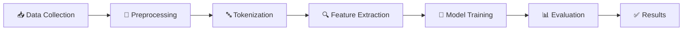

<div align="center">

# 🍽️ Sentiment Analysis of Restaurant Reviews

### *Unlock Customer Insights with AI-Powered Sentiment Analysis*

[](https://opensource.org/licenses/MIT)
[](https://www.python.org/downloads/)
[](https://jupyter.org/)
[](https://github.com/OMAR622-ai/-Sentiment-Analysis-of-Restaurant-Reviews-)
[](https://github.com/OMAR622-ai/-Sentiment-Analysis-of-Restaurant-Reviews-/issues)
[](http://makeapullrequest.com)

</div>

---

<p align="center">
  <strong>A comprehensive machine learning project for analyzing customer sentiments in restaurant reviews using Natural Language Processing (NLP) techniques.</strong>
</p>

<p align="center">
  <em>Transform unstructured customer feedback into actionable business insights</em>
</p>

---

## 📋 Table of Contents

<details open>
<summary><b>Click to expand</b></summary>

- [Overview](#-overview)
- [Why This Project?](#-why-this-project)
- [Features](#-features)
- [Dataset](#-dataset)
- [Installation](#-installation)
- [Usage](#-usage)
- [Methodology](#-methodology)
- [Results](#-results)
- [Project Structure](#-project-structure)
- [Technologies Used](#️-technologies-used)
- [Contributing](#-contributing)
- [License](#-license)
- [Acknowledgments](#-acknowledgments)
- [Connect & Contribute](#-connect--contribute)

</details>

---

---

## 🔍 Overview

<table>
<tr>
<td>

**What is Sentiment Analysis?**

Sentiment analysis, also known as opinion mining, is a powerful Natural Language Processing (NLP) technique used to determine and evaluate the sentiments and opinions expressed in textual data. 

**Our Solution**

This project applies machine learning algorithms to classify restaurant reviews as positive or negative, helping businesses:
- 📊 Understand customer satisfaction levels
- 💡 Make data-driven decisions
- 🎯 Identify improvement opportunities
- ⭐ Enhance overall customer experience

</td>
</tr>
</table>

---

## 🎯 Why This Project?

<table>
<tr>
<td width="33%" align="center">

### 🎓 Educational Value
Perfect for learning NLP and ML fundamentals through a practical, real-world application

</td>
<td width="33%" align="center">

### 💼 Business Application
Demonstrates how AI can extract actionable insights from customer feedback

</td>
<td width="33%" align="center">

### 🔬 Research Ready
Well-structured codebase ideal for experimentation and enhancement

</td>
</tr>
</table>

**Key Benefits:**

- ✅ **Hands-on Learning**: Complete end-to-end ML pipeline implementation
- ✅ **Industry Relevant**: Solves a real business problem
- ✅ **Reproducible**: Well-documented and easy to replicate
- ✅ **Extensible**: Can be adapted for other domains (product reviews, social media, etc.)

---

## ✨ Features

<table>
<tr>
<td width="50%">

### 🔧 Technical Features
- **Text Preprocessing**: Comprehensive data cleaning including punctuation removal, tokenization, stopword removal, and lemmatization
- **Machine Learning Classification**: Implementation of supervised learning algorithms for sentiment prediction
- **Feature Engineering**: Bag of Words and TF-IDF vectorization

</td>
<td width="50%">

### 📊 Analysis Features
- **Data Visualization**: Clear visual representations of sentiment distributions and trends
- **Reproducible Analysis**: Well-documented Jupyter notebook with step-by-step implementation
- **Real-world Dataset**: Analysis of 1,000 actual restaurant customer reviews

</td>
</tr>
</table>

## 📊 Dataset

<div align="center">

| **Attribute** | **Description** |
|---------------|-----------------|
| 📝 **Dataset Name** | Restaurant Reviews |
| 📄 **File Format** | TSV (Tab-Separated Values) |
| 🔢 **Total Reviews** | 1,000 customer reviews |
| 📊 **Features** | Review text + Binary sentiment label |
| ✅ **Positive Label** | 1 (Satisfied customers) |
| ❌ **Negative Label** | 0 (Dissatisfied customers) |

</div>

### Dataset Structure

The dataset (`Restaurant_Reviews.tsv`) contains:

- **Review**: Text of the customer review (unstructured text data)
- **Liked**: Binary label (1 = Positive, 0 = Negative)

**Sample Data Preview:**

| Review | Liked |
|--------|-------|
| "Wow... Loved this place." | 1 |
| "Crust is not good." | 0 |
| "Not tasty and the texture was just nasty." | 0 |
| "The selection on the menu was great..." | 1 |

The dataset was collected from restaurant feedback surveys and includes diverse customer opinions about food quality, service, ambiance, and overall experience.

## 🚀 Installation

<details open>
<summary><b>📋 Prerequisites</b></summary>

<br>

Before you begin, ensure you have the following installed:

- ✅ Python 3.7 or higher
- ✅ pip package manager
- ✅ Jupyter Notebook
- ✅ Git (for cloning the repository)

</details>

<details open>
<summary><b>⚡ Quick Start</b></summary>

<br>

Get up and running in just 3 steps:

### 1️⃣ Clone the Repository
```bash
git clone https://github.com/OMAR622-ai/-Sentiment-Analysis-of-Restaurant-Reviews-.git
cd -Sentiment-Analysis-of-Restaurant-Reviews-
```

### 2️⃣ Install Dependencies
```bash
pip install -r requirements.txt
```

### 3️⃣ Launch Jupyter Notebook
```bash
jupyter notebook
```

Then open `Sentiment_Analysis.ipynb` and run all cells! 🎉

</details>

<details>
<summary><b>🔧 Detailed Setup Instructions</b></summary>

<br>

### Step-by-Step Guide

1. **Clone the repository**
   ```bash
   git clone https://github.com/OMAR622-ai/-Sentiment-Analysis-of-Restaurant-Reviews-.git
   cd -Sentiment-Analysis-of-Restaurant-Reviews-
   ```

2. **Create a virtual environment** (recommended)
   ```bash
   # Windows
   python -m venv venv
   venv\Scripts\activate
   
   # macOS/Linux
   python3 -m venv venv
   source venv/bin/activate
   ```

3. **Install required packages**
   ```bash
   pip install -r requirements.txt
   ```

4. **Download NLTK data** (if needed)
   ```python
   import nltk
   nltk.download('stopwords')
   nltk.download('wordnet')
   ```

5. **Verify installation**
   ```bash
   python -c "import pandas, numpy, sklearn, nltk; print('All packages installed successfully!')"
   ```

</details>

## 💻 Usage

<details open>
<summary><b>🎯 Running the Analysis</b></summary>

<br>

### Option 1: Jupyter Notebook (Recommended)

1. **Launch Jupyter Notebook**
   ```bash
   jupyter notebook
   ```

2. **Open the analysis notebook**
   - Navigate to `Sentiment_Analysis.ipynb` in the browser
   - Run cells sequentially (Shift + Enter) to reproduce the analysis

3. **Explore the data**
   - 📊 Load and examine the restaurant reviews dataset
   - 📈 Visualize sentiment distributions
   - 🤖 Train and evaluate the sentiment classification model
   - 🔍 Analyze results and insights

### Option 2: JupyterLab

```bash
pip install jupyterlab
jupyter lab
```

### Option 3: Google Colab

1. Upload the notebook to [Google Colab](https://colab.research.google.com/)
2. Upload `Restaurant_Reviews.tsv` to the Colab session
3. Run all cells

</details>

<details>
<summary><b>📊 Expected Output</b></summary>

<br>

When you run the notebook, you'll see:

- ✅ Data loading and preprocessing steps
- ✅ Visualizations of sentiment distributions
- ✅ Model training progress
- ✅ Performance metrics (accuracy, precision, recall, F1-score)
- ✅ Confusion matrix
- ✅ Sample predictions on test data

</details>

## 🔬 Methodology

<div align="center">



</div>

### 1. Data Collection
The dataset was obtained from a restaurant feedback survey conducted over a specific period, collecting comments and ratings from customers who had recently dined at various restaurants.

### 2. Data Preprocessing
The textual data undergoes several preprocessing steps:

| Step | Description | Purpose |
|------|-------------|---------|
| **Text Cleaning** | Remove punctuation, special characters, and irrelevant symbols | Standardize text format |
| **Tokenization** | Split sentences into individual words or tokens | Break down text into analyzable units |
| **Stopword Removal** | Eliminate common words (e.g., "the," "and," "in") | Focus on meaningful content words |
| **Lemmatization** | Reduce words to their base or dictionary form | Standardize word variations |

### 3. Sentiment Analysis
Sentiment analysis is performed using supervised machine learning approaches:

- **Feature Extraction**: Converting text data into numerical features using techniques like Bag of Words or TF-IDF
- **Model Training**: Training classifiers on labeled data (positive/negative) to predict sentiment
- **Model Evaluation**: Assessing performance using metrics like accuracy, precision, recall, and F1-score

## 📈 Results

<div align="center">

### 🎯 Key Performance Metrics

| Metric | Description |
|--------|-------------|
| **Accuracy** | Overall classification performance |
| **Precision** | Ratio of correct positive predictions |
| **Recall** | Ability to find all positive instances |
| **F1-Score** | Harmonic mean of precision and recall |

</div>

The sentiment analysis yielded valuable insights:

### Overall Sentiment Distribution
- **Positive Reviews**: Analysis shows the percentage of satisfied customers
- **Negative Reviews**: Identifies areas needing improvement

### 📝 Key Findings

<table>
<tr>
<td width="50%" valign="top">

**😊 Common Positive Sentiments:**
- ⭐ Praise for food quality and taste
- 👥 Compliments for attentive and friendly staff
- 🏠 Positive remarks about restaurant ambiance
- 💰 Good value for money
- 🍽️ Excellent portion sizes

</td>
<td width="50%" valign="top">

**😞 Common Negative Sentiments:**
- ⏰ Complaints about long wait times for service
- 💵 Criticisms of portion sizes or pricing
- 🧹 Dissatisfaction with cleanliness or hygiene
- 🥘 Food quality issues
- 👎 Poor customer service

</td>
</tr>
</table>

### 💼 Business Impact

<table>
<tr>
<td>

The analysis provides actionable insights for:

| Area | Benefit |
|------|---------|
| 📊 **Customer Satisfaction** | Identify satisfaction levels and trends |
| 🎯 **Service Quality** | Pinpoint areas requiring improvement |
| 💡 **Data-Driven Decisions** | Make informed operational choices |
| ⚡ **Competitive Advantage** | Understand strengths vs. competitors |
| 🔄 **Continuous Improvement** | Monitor changes over time |

</td>
</tr>
</table>

## 📁 Project Structure

```
-Sentiment-Analysis-of-Restaurant-Reviews-/
│
├── Sentiment_Analysis.ipynb    # Main analysis notebook
├── Restaurant_Reviews.tsv      # Dataset file
├── requirements.txt            # Python dependencies
├── README.md                   # Project documentation
├── LICENSE                     # MIT License
└── .gitignore                 # Git ignore file
```

## 🛠️ Technologies Used

<div align="center">

### Core Technologies

| Technology | Purpose | Version |
|------------|---------|---------|
|  | Core programming language | 3.7+ |
|  | Data manipulation and analysis | Latest |
|  | Numerical computing | Latest |
|  | Machine learning algorithms | Latest |
|  | Interactive development | Latest |

### Visualization & NLP

| Technology | Purpose |
|------------|---------|
| **Matplotlib** | Data visualization and plotting |
| **Seaborn** | Statistical data visualization |
| **NLTK** | Natural language processing toolkit |

</div>

## 🤝 Contributing

<div align="center">

**We love contributions! 💖**

[](https://github.com/OMAR622-ai/-Sentiment-Analysis-of-Restaurant-Reviews-/graphs/contributors)
[](https://github.com/OMAR622-ai/-Sentiment-Analysis-of-Restaurant-Reviews-/issues)
[](https://github.com/OMAR622-ai/-Sentiment-Analysis-of-Restaurant-Reviews-/pulls)

</div>

Contributions are welcome! Whether you're fixing bugs, improving documentation, or adding new features, we appreciate your help!

### 🚀 Quick Contribution Guide

<table>
<tr>
<td>

**1️⃣ Fork & Clone**
```bash
git clone https://github.com/your-username/-Sentiment-Analysis-of-Restaurant-Reviews-.git
```

</td>
<td>

**2️⃣ Create Branch**
```bash
git checkout -b feature/AmazingFeature
```

</td>
<td>

**3️⃣ Commit & Push**
```bash
git commit -m 'Add AmazingFeature'
git push origin feature/AmazingFeature
```

</td>
<td>

**4️⃣ Open PR**

Submit your Pull Request!

</td>
</tr>
</table>

### 💡 Contribution Ideas

- 🐛 **Bug Fixes**: Found an issue? Fix it!
- 📝 **Documentation**: Improve explanations or add examples
- ✨ **New Features**: Add new ML models or visualizations
- 🧪 **Testing**: Add unit tests or improve test coverage
- 🎨 **UI/UX**: Enhance notebook visualizations
- 🌍 **Translations**: Translate documentation to other languages

Please read [CONTRIBUTING.md](CONTRIBUTING.md) for detailed guidelines.

---

## 📄 License

This project is licensed under the MIT License - see the [LICENSE](LICENSE) file for details.

<div align="center">

## 🙏 Acknowledgments

*Special thanks to the following resources and communities*

[](https://github.com/)
[](https://stackoverflow.com/)

- 📚 Dataset source and inspiration for sentiment analysis in the restaurant industry
- 🌟 The open-source community for providing excellent NLP tools and libraries
- 👥 Contributors and maintainers of scikit-learn, NLTK, and other dependencies
- 💡 All researchers and developers in the NLP and ML community

</div>

---

<div align="center">

## 📧 Connect & Contribute

[](https://github.com/OMAR622-ai)
[](https://github.com/OMAR622-ai/-Sentiment-Analysis-of-Restaurant-Reviews-/stargazers)
[](https://github.com/OMAR622-ai/-Sentiment-Analysis-of-Restaurant-Reviews-/network/members)

**For questions, suggestions, or collaboration opportunities:**

[🐛 Report Bug](https://github.com/OMAR622-ai/-Sentiment-Analysis-of-Restaurant-Reviews-/issues) • 
[✨ Request Feature](https://github.com/OMAR622-ai/-Sentiment-Analysis-of-Restaurant-Reviews-/issues) • 
[🤝 Contribute](CONTRIBUTING.md)

</div>

---

<div align="center">

**⭐ Star this repository if you found it helpful! ⭐**

*Made with ❤️ and Python for better understanding of customer sentiments*

[](https://forthebadge.com)
[](https://forthebadge.com)
[](https://forthebadge.com)

</div>
